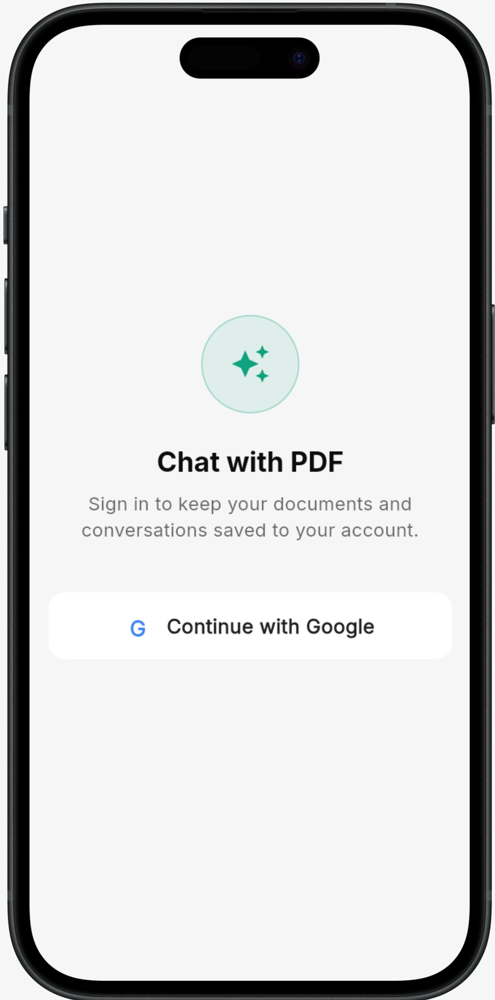
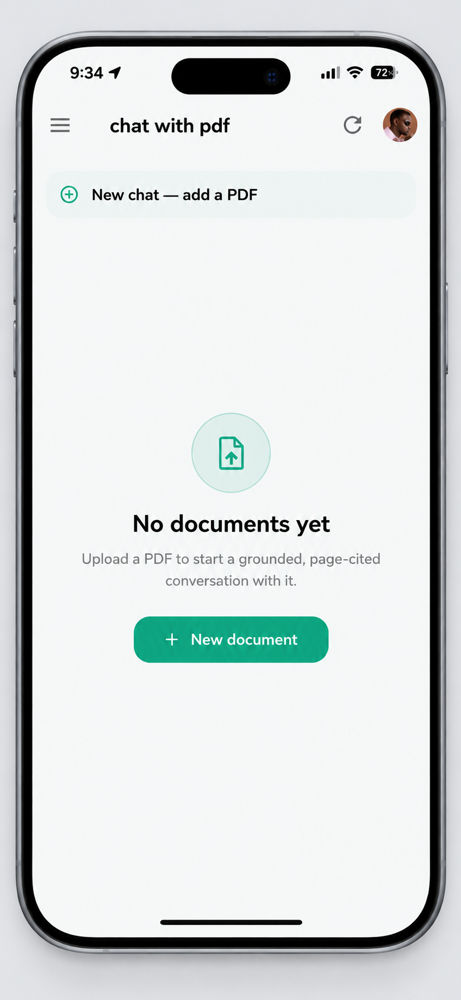
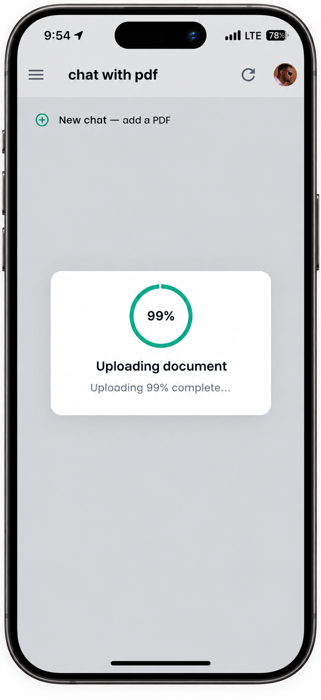
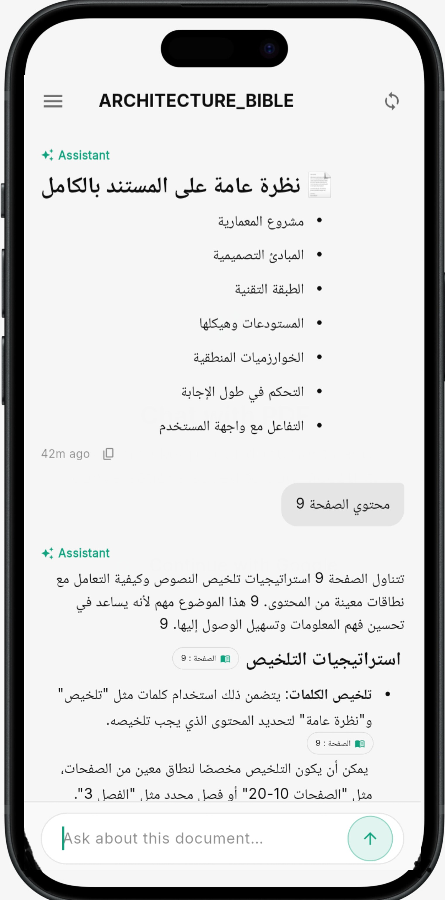
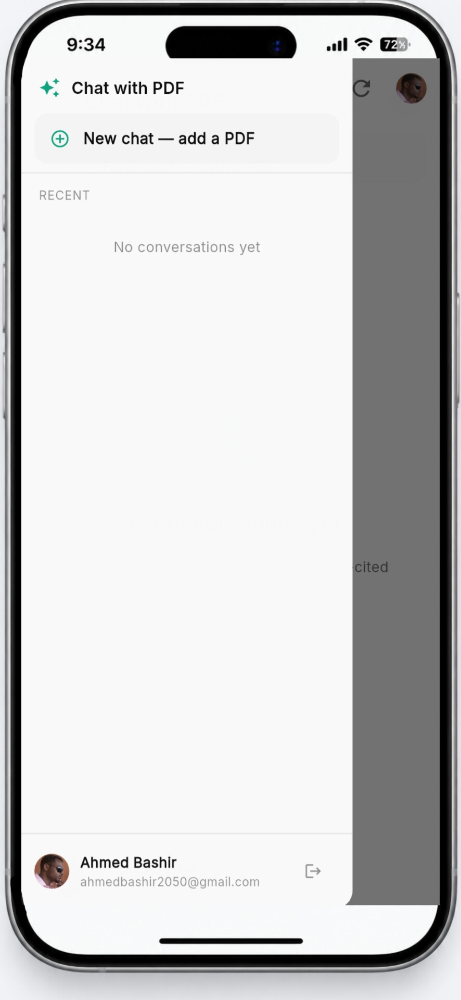

# Chat With PDF

An AI-powered document question-answering application that allows users to upload PDF documents, ask questions about their content, and receive grounded AI-generated answers with physical PDF page citations.

The project consists of a **Flutter client application** and a **FastAPI RAG backend** using **Qdrant** for vector search and **OpenAI** for AI-powered processing.

---

## Overview

Chat With PDF is designed to provide a reliable way to interact with PDF documents using Retrieval-Augmented Generation (RAG).

Instead of sending the entire document directly to an AI model, the system:

1. Processes the PDF.
2. Extracts and analyzes its content.
3. Splits the document into meaningful chunks.
4. Creates vector embeddings.
5. Stores the vectors in Qdrant.
6. Analyzes the user's question.
7. Retrieves relevant document evidence.
8. Reranks and prepares the context.
9. Generates an answer using an LLM.
10. Validates claims and citations.
11. Returns the grounded answer to the Flutter application.

---

## Main Features

### Document Processing

* PDF text extraction
* Physical PDF page tracking
* Arabic and English document support
* OCR when required
* Layout analysis
* Table extraction
* Image extraction
* Semantic chunking
* Document hierarchy
* Document quality checks

### AI / RAG

* Query analysis
* Intent classification
* Entity extraction
* Query rewriting
* Semantic search
* Keyword search
* Hybrid retrieval
* Context expansion
* Reranking
* Context compression
* LLM answer generation
* Claim verification
* Citation validation

### User Application

* User authentication
* Google Sign-In
* Chat creation
* Chat history
* PDF upload
* Document questions
* AI answers
* Markdown responses
* Arabic and English support
* Interactive PDF page references

## 📱 Screenshots

The Chat With PDF application provides a clean interface for uploading PDF documents, asking questions, viewing AI-generated answers, and navigating to the relevant PDF pages.

### 🔐 Login

<p align="center">
  
</p>

### 🏠 Home

<p align="center">
  
</p>

### 📄 Upload PDF

<p align="center">
  
</p>

### 💬 Chat With PDF

<p align="center">
  
</p>

### 📖 Drawer

<p align="center">
  
</p>


---

## 📸 Application Preview

<p align="center">
  
  
  
  
</p>

---

# System Architecture

```text
                         CHAT WITH PDF
                              │
               ┌──────────────┴──────────────┐
               │                             │
               ▼                             ▼
        Flutter Application            FastAPI Backend
               │                             │
               │ HTTP / REST                 │
               └──────────────┬──────────────┘
                              │
                              ▼
                       Query Processing
                              │
                  ┌───────────┴───────────┐
                  │                       │
                  ▼                       ▼
            Query Analysis          Query Rewriting
                  │                       │
                  └───────────┬───────────┘
                              │
                              ▼
                         Retrieval
                              │
              ┌───────────────┼───────────────┐
              │               │               │
              ▼               ▼               ▼
         Semantic         Keyword          Hybrid
          Search           Search          Search
              │               │               │
              └───────────────┼───────────────┘
                              │
                              ▼
                           Qdrant
                              │
                              ▼
                         Reranking
                              │
                              ▼
                     Context Management
                              │
                              ▼
                       OpenAI / LLM
                              │
                              ▼
                    Claim Verification
                              │
                              ▼
                    Citation Validation
                              │
                              ▼
                       Final Answer
                              │
                              ▼
                     Flutter Chat UI
```

---

# Project Structure

```text
chat-With-pdf/
│
├── Flutter/
│   │
│   ├── android/
│   ├── ios/
│   ├── linux/
│   ├── macos/
│   ├── web/
│   ├── windows/
│   │
│   ├── assets/
│   │
│   ├── lib/
│   │   ├── controllers/
│   │   ├── screens/
│   │   ├── widgets/
│   │   ├── services/
│   │   ├── models/
│   │   ├── theme/
│   │   └── main.dart
│   │
│   ├── test/
│   ├── pubspec.yaml
│   └── README.md
│
├── Backend/
│   │
│   ├── app/
│   │   ├── api/
│   │   ├── application/
│   │   ├── context/
│   │   ├── domain/
│   │   ├── llm/
│   │   ├── longcontext/
│   │   ├── parsing/
│   │   ├── query/
│   │   ├── retrieval/
│   │   ├── security/
│   │   ├── storage/
│   │   ├── vector/
│   │   ├── vectorstore/
│   │   ├── config.py
│   │   ├── database.py
│   │   ├── models.py
│   │   ├── schemas.py
│   │   └── main.py
│   │
│   ├── Dockerfile
│   ├── docker-compose.yml
│   ├── requirements.txt
│   └── README.md
│
├── .gitignore
└── README.md
```

---

# Technology Stack

## Frontend

| Technology              | Purpose                    |
| ----------------------- | -------------------------- |
| Flutter                 | Cross-platform application |
| Dart                    | Application language       |
| GetX                    | State management           |
| Firebase Authentication | User authentication        |
| REST API                | Backend communication      |

## Backend

| Technology     | Purpose                     |
| -------------- | --------------------------- |
| Python         | Backend language            |
| FastAPI        | REST API                    |
| OpenAI         | LLM / AI processing         |
| Qdrant         | Vector database             |
| PyMuPDF        | PDF processing              |
| Docker         | Containerization            |
| Docker Compose | Local service orchestration |

---

# Application Flow

## 1. User Authentication

```text
User
 │
 ▼
Flutter Login Screen
 │
 ├── Email / Password
 │
 └── Google Sign-In
 │
 ▼
Authentication Service
 │
 ▼
Authenticated User
 │
 ▼
Home Screen
```

---

## 2. PDF Upload

```text
Flutter
   │
   │ Upload PDF
   ▼
FastAPI
   │
   ▼
PDF Parser
   │
   ├── Text Extraction
   ├── Page Detection
   ├── Language Detection
   ├── OCR
   ├── Layout Processing
   └── Table / Image Processing
   │
   ▼
Semantic Chunking
   │
   ▼
Embeddings
   │
   ▼
Qdrant
```

---

## 3. Asking a Question

```text
User Question
      │
      ▼
Flutter Chat Screen
      │
      ▼
FastAPI API
      │
      ▼
Query Analysis
      │
      ├── Intent
      ├── Entities
      └── Query Understanding
      │
      ▼
Query Rewriting
      │
      ▼
Retrieval
      │
      ├── Semantic Search
      ├── Keyword Search
      └── Hybrid Search
      │
      ▼
Qdrant
      │
      ▼
Context Expansion
      │
      ▼
Reranking
      │
      ▼
Context Compression
      │
      ▼
LLM
      │
      ▼
Claim Verification
      │
      ▼
Citation Validation
      │
      ▼
Grounded Answer
      │
      ▼
Flutter
```

---

# RAG Pipeline

The core RAG pipeline is designed around document evidence.

```text
PDF
 │
 ▼
Parsing
 │
 ▼
Chunks
 │
 ▼
Embeddings
 │
 ▼
Qdrant
 │
 └──────────────┐
                │
User Question   │
      │         │
      ▼         │
Query Analysis  │
      │         │
      ▼         │
Query Rewrite   │
      │         │
      └────┬────┘
           ▼
       Retrieval
           │
           ▼
       Reranking
           │
           ▼
      Context Builder
           │
           ▼
        OpenAI
           │
           ▼
    Claim Verification
           │
           ▼
    Citation Validation
           │
           ▼
      Final Answer
```

The goal is to ensure that answers are based on retrieved document evidence rather than unsupported model-generated information.

---

# PDF Page Citations

The system tracks the physical PDF page associated with document chunks.

Answers can contain references such as:

```text
[p. 17]
```

These references identify the physical PDF page containing the supporting evidence.

The Flutter application converts these references into interactive page-reference UI elements.

The citation system is designed to:

* Preserve physical page information
* Avoid page-label ambiguity
* Prevent off-by-one page errors
* Validate citations
* Remove duplicate page references
* Display citations in the chat interface

---

# Arabic and English Support

The application supports both Arabic and English documents and questions.

The system is designed to handle:

```text
Arabic
English
Mixed Arabic / English
Arabic-Indic digits
```

The Flutter UI supports appropriate text direction and rendering for Arabic content.

The backend also performs language detection and document processing suitable for multilingual documents.

---

# Running the Project

## Prerequisites

Install:

* Git
* Flutter SDK
* Dart SDK
* Python 3.11+
* Docker Desktop
* Android Studio
* Android SDK

Verify Flutter:

```powershell
flutter doctor
```

Verify Python:

```powershell
python --version
```

Verify Docker:

```powershell
docker --version
```

---

# Run the Backend

Open a terminal in:

```text
Backend/
```

Start the services:

```powershell
docker compose up --build
```

The FastAPI API will normally be available at:

```text
http://localhost:8000
```

Swagger API documentation:

```text
http://localhost:8000/docs
```

ReDoc:

```text
http://localhost:8000/redoc
```

For complete backend instructions, see:

**[Backend README](Backend/README.md)**

---

# Run the Flutter Application

Open a terminal in:

```text
Flutter/
```

Install dependencies:

```powershell
flutter pub get
```

Check available devices:

```powershell
flutter devices
```

Run:

```powershell
flutter run
```

For complete Flutter instructions, see:

**[Flutter README](Flutter/README.md)**

---

# Local Development

The recommended local development setup is:

```text
┌───────────────────────────┐
│      Flutter Client       │
│                           │
│ Android / Web / Windows   │
└─────────────┬─────────────┘
              │
              │ HTTP
              ▼
┌───────────────────────────┐
│      FastAPI Backend      │
│       Port 8000           │
└─────────────┬─────────────┘
              │
       ┌──────┴──────┐
       │             │
       ▼             ▼
   PostgreSQL      Qdrant
                     │
                     ▼
                  OpenAI
```

---

# Backend URLs

During local development:

```text
FastAPI:
http://localhost:8000

Swagger:
http://localhost:8000/docs

Qdrant:
http://localhost:6333
```

When running Flutter on a physical Android device, `localhost` refers to the phone itself.

For local development with a physical device, configure the Flutter application to use the development computer's local network IP.

For an Android emulator, the host machine can normally be accessed through:

```text
http://10.0.2.2:8000
```

---

# Production Architecture

A possible production architecture is:

```text
                    Internet
                       │
                       ▼
              ┌─────────────────┐
              │ Flutter Web/App  │
              └────────┬────────┘
                       │
                       ▼
              ┌─────────────────┐
              │   Cloud Run     │
              │ FastAPI Backend │
              └────────┬────────┘
                       │
              ┌────────┴────────┐
              │                 │
              ▼                 ▼
          Qdrant Cloud        OpenAI
```

The FastAPI backend is containerized and can be deployed to Google Cloud Run.

Production secrets should be stored using environment variables or a dedicated secret-management system.

---

# Security

Never commit sensitive credentials to GitHub.

Do not commit:

```text
.env
*.pem
*.key
credentials.json
service-account.json
```

Sensitive information includes:

* OpenAI API keys
* Database credentials
* JWT secrets
* Firebase private credentials
* Qdrant API keys
* Cloud service credentials

Use environment variables and secret-management services instead.

---

# Testing

## Flutter

Run tests:

```powershell
cd Flutter
flutter test
```

Static analysis:

```powershell
flutter analyze
```

Format code:

```powershell
dart format .
```

## Backend

Run tests:

```powershell
cd Backend
pytest
```

Verbose:

```powershell
pytest -v
```

---

# Building Flutter

## Web

```powershell
cd Flutter
flutter build web --release
```

Output:

```text
Flutter/build/web/
```

## Android APK

```powershell
flutter build apk --release
```

## Android App Bundle

```powershell
flutter build appbundle --release
```

## Windows

```powershell
flutter build windows --release
```

## Linux

```powershell
flutter build linux --release
```

## macOS

```powershell
flutter build macos --release
```

---

# Docker Backend

Build the backend:

```powershell
cd Backend
docker build -t chat-with-pdf-backend .
```

Run the complete local environment:

```powershell
docker compose up --build
```

Stop services:

```powershell
docker compose down
```

View backend logs:

```powershell
docker compose logs -f app
```

---

# Development Workflow

```text
Clone Repository
       │
       ▼
Install Flutter Dependencies
       │
       ▼
Install Backend Dependencies
       │
       ▼
Configure Environment
       │
       ▼
Start Qdrant + FastAPI
       │
       ▼
Start Flutter
       │
       ▼
Login
       │
       ▼
Upload PDF
       │
       ▼
Ask Questions
       │
       ▼
Verify Answers / Citations
       │
       ▼
Run Tests
       │
       ▼
Commit Changes
       │
       ▼
Push to GitHub
```

---

# Repository Documentation

The project contains separate documentation for each major component.

### Flutter

The Flutter README covers:

* Flutter setup
* Application architecture
* Authentication
* Chat UI
* PDF interaction
* API configuration
* Android
* Web
* Windows
* Linux
* macOS

**[Open Flutter README](Flutter/README.md)**

### Backend

The backend README covers:

* FastAPI architecture
* RAG pipeline
* PDF processing
* Qdrant
* Docker
* API endpoints
* Citations
* Cloud Run deployment

**[Open Backend README](Backend/README.md)**

---

# Repository

GitHub:

**[Chat With PDF](https://github.com/ahmedbashir2050/chat-With-pdf)**

---

# Project Status

The project is under active development.

Current major components:

* Flutter client
* FastAPI backend
* PDF processing pipeline
* Qdrant vector search
* RAG retrieval pipeline
* OpenAI integration
* Citation validation
* Claim verification
* Arabic / English document support
* Docker deployment
* Cloud Run deployment preparation

---

# License

A project license can be added here when the final licensing decision has been made.

---

## Author

**Ahmed Bashir**

GitHub:
https://github.com/ahmedbashir2050

---
